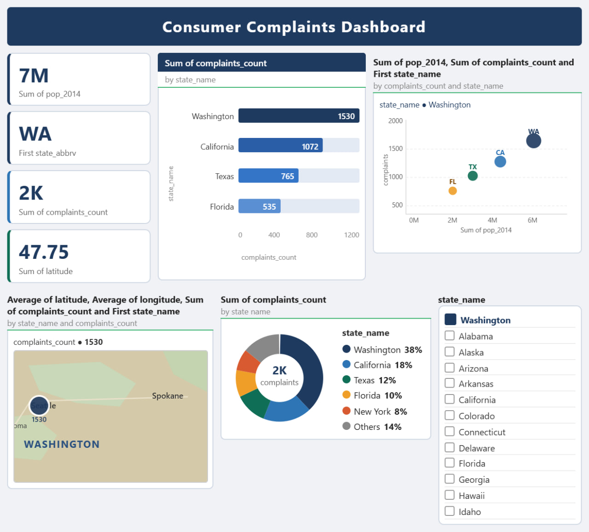
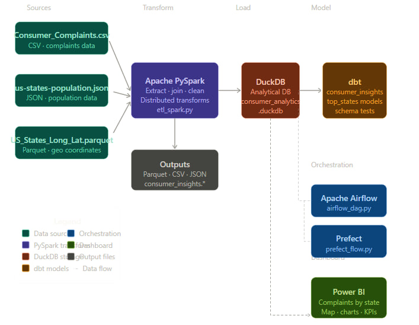

# Consumer Complaints Big Data ETL Pipeline & Analytics Dashboard



## Project Overview

This project is a **Big Data ETL (Extract, Transform, Load) Pipeline** developed using modern data engineering tools such as **Apache Spark (PySpark), DuckDB, Prefect, Airflow, and dbt**.

The system processes large-scale consumer complaint datasets from multiple file formats, performs distributed data transformation, and prepares analytics-ready outputs for reporting and visualization.

The project demonstrates:

- Big data processing with PySpark
- Multi-format data ingestion
- Distributed ETL workflow design
- Data orchestration and scheduling
- Analytical data storage using DuckDB
- Dashboard and business intelligence integration

### Project Objectives

The main objective of this project is to build a scalable and efficient ETL pipeline that:

1. Extracts data from different file formats
2. Cleans and transforms raw datasets
3. Joins related datasets together
4. Stores processed data for analytics
5. Supports business intelligence and dashboard reporting

---

## 🖼️ Visuals

### System Architecture Diagram


### Power BI Style Interactive Dashboard


---

## Technologies Used

| Technology              | Purpose                              |
|-------------------------|--------------------------------------|
| Python                  | Core programming language            |
| Apache Spark (PySpark)  | Distributed data processing          |
| DuckDB                  | Analytical database engine           |
| Prefect                 | Workflow orchestration               |
| Apache Airflow          | Pipeline scheduling                  |
| dbt                     | Data transformation modeling         |
| Pandas                  | Data analysis support                |
| Parquet                 | Columnar storage format              |
| JSON                    | Semi-structured data format          |
| CSV                     | Structured tabular data              |

---

## Dataset Sources

| File                           | Format   | Description                              |
|--------------------------------|----------|------------------------------------------|
| `Consumer_Complaints.csv`      | CSV      | Consumer complaint records               |
| `us-states-population.json`    | JSON     | Population data by state                 |
| `US_States_Long_Lat.parquet`   | Parquet  | Geographic coordinates of states         |

---

## Architecture

**Source files** → **PySpark Extraction** → **Transformation & Join** → **DuckDB Analytical Store**

### Key Outputs
- `output/consumer_insights.parquet`
- `output/consumer_insights.csv`
- `output/consumer_insights.json`
- `output/consumer_analytics.duckdb`

---

## Team Contributions

| No. | Student ID | Full Name           | Primary Contribution                          |
|-----|------------|---------------------|-----------------------------------------------|
| 1   | 1601636    | Surafel Arega       | PySpark ETL design and data extraction        |
| 2   | 1601162    | Eyob Mulugeta       | DuckDB loading and data transformation        |
| 3   | 1601577    | Rekik Yosef         | Prefect orchestration and pipeline scheduling |
| 4   | 1601573    | Rediet Goshu        | Airflow DAG and workflow management           |
| 5   | 1601519    | Alemtsehay Drebe    | dbt models and data testing                   |
| 6   | 1601465    | Abebech Asnake      | BI dashboard and README documentation         |

---

## Installation

1. Open a terminal in the repository root (`consumer-complaints-etl`)
2. Create virtual environment and install dependencies:

```bash
python -m venv venv
venv\Scripts\activate
pip install -r requirements.txt